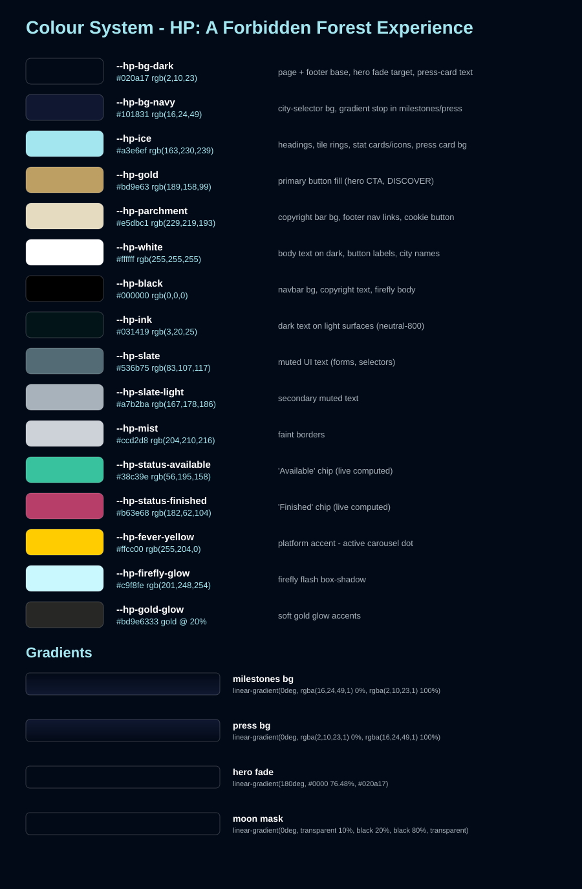
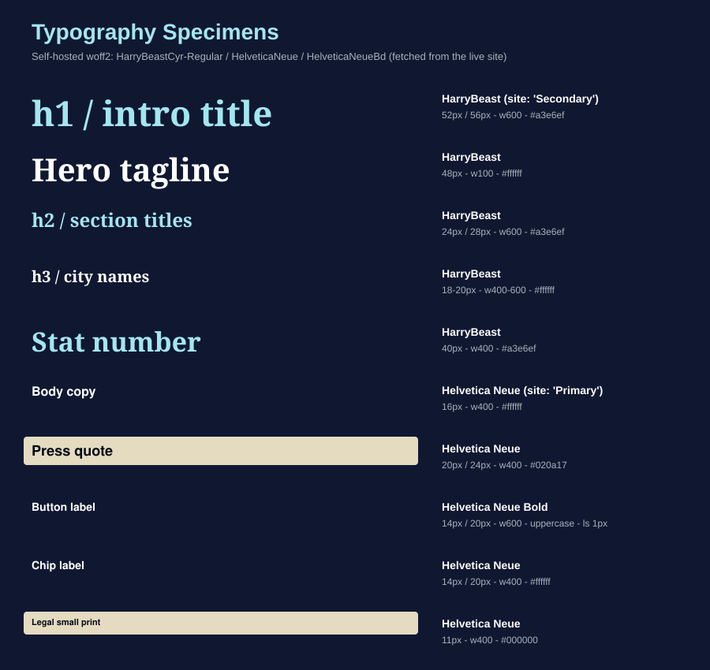
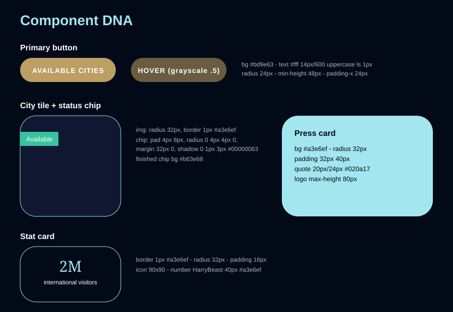
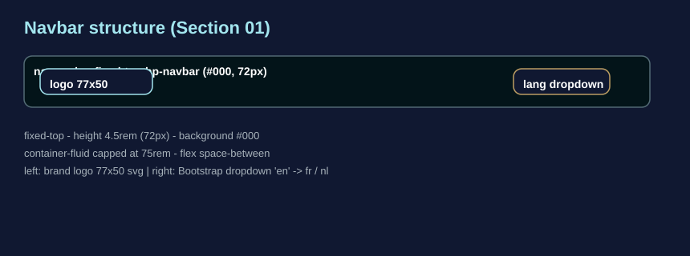
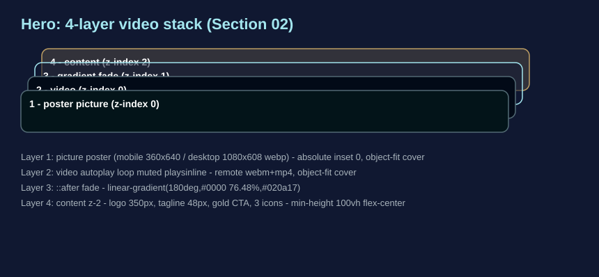
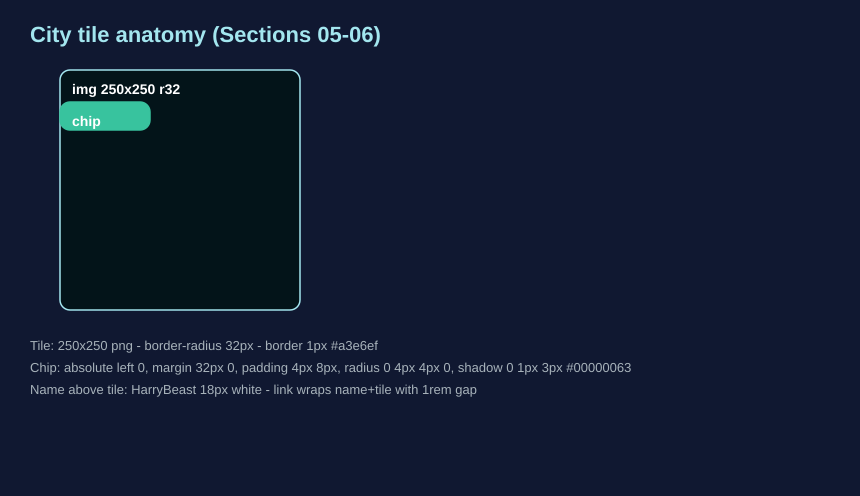
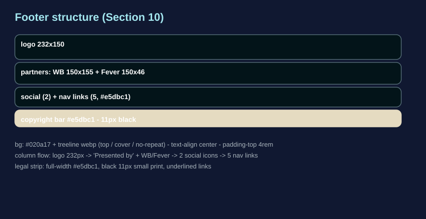

# 🌲✨ Harry Potter: A Forbidden Forest Experience — Bootstrap 5 Rebuild

  

Hey! This is our Bootstrap 5 rebuild of **Harry Potter: A Forbidden Forest Experience**
([hpforbiddenforestexperience.com](https://hpforbiddenforestexperience.com/)) — a nighttime forest trail
site made of glowing mushrooms, drifting fireflies and parchment-gold buttons. Here's how it's put together.

> 💡 **Live Preview tip:** in VS Code, press `Ctrl/Cmd + Shift + V` for Markdown preview, or open
> `index.html` with the Live Server extension.

---

## 🛠️ How This Was Made

1. **Saved Raw Page:** Exported the live site assets into `_raw/`.
2. **Asset Extraction:** Downloaded missing fonts, images, and media assets into the `assets/` folder.
3. **Style Analysis:** Extracted colors, typography, and layout rules from the original stylesheet.
4. **Bootstrap Rebuild:** Rebuilt the site with Bootstrap 5.3.3 and a custom `css/styles.css` brand layer.
5. **Verification:** Validated layout and visual consistency against the live site (see [`verification-report.md`](verification-report.md)).

## 📥 Getting the Files from GitHub

Repository URL: [https://github.com/thedalycreative/s02-a01-BootstrapClone-2613](https://github.com/thedalycreative/s02-a01-BootstrapClone-2613)

### Option 1: Download as ZIP
1. Visit the repository on GitHub: [https://github.com/thedalycreative/s02-a01-BootstrapClone-2613](https://github.com/thedalycreative/s02-a01-BootstrapClone-2613)
2. Click the green **Code** button at the top right of the file list.
3. Click **Download ZIP** from the dropdown menu.
4. Extract the downloaded ZIP archive on your computer.

### Option 2: Clone via Terminal
Open your terminal (macOS/Linux) or Command Prompt / PowerShell (Windows) and run:

```bash
# Clone the repository
git clone https://github.com/thedalycreative/s02-a01-BootstrapClone-2613.git

# Change into the project directory
cd s02-a01-BootstrapClone-2613
```

---

## 🚀 Running the Project

Because this project is built using static HTML5, CSS3 (Bootstrap 5.3.3), and standard web assets, **no build step, bundler, or `npm install` is required**.

You can run the site using any of the following methods:

- **Direct in Browser:** Double-click `index.html` or drag and drop `index.html` into any modern web browser (Chrome, Safari, Firefox, Edge).
- **VS Code Live Server:** Open the project folder in VS Code, right-click `index.html`, and select **Open with Live Server**.

```
S02-A01-BootstrapClone/
├── index.html              ← the finished Bootstrap 5 clone
├── css/styles.css          ← brand-layer stylesheet (variables, fonts, glows, keyframes)
├── assets/00-universal/    ← favicons, logo, flourish, bg textures, fonts
├── assets/01-navbar/       ← language dropdown flag icons
├── assets/02-hero/         ← posters, videos, mobile-video-source-url.txt
├── assets/03-intro/        ← moon
├── assets/04-milestones/   ← stat icons
├── assets/05-city-selector/← Perth tile image
├── assets/06-finished-experiences/ ← 15 city tile images
├── assets/07-press/        ← 6 outlet logos
├── assets/08-sorting-hat/  ← sorting hat image
├── assets/10-footer/       ← WB + Fever partner logos, treeline
└── assets/styleguide/      ← badges, boards, diagrams
```

---

## 🎨 Colour System



| Variable | Hex | RGB | Used for |
|----------|-----|-----|----------|
| `--hp-bg-dark` | `#020a17` | 2,10,23 | page + footer base, hero fade target, press-card text |
| `--hp-bg-navy` | `#101831` | 16,24,49 | city-selector bg, gradient stop |
| `--hp-ice` | `#a3e6ef` | 163,230,239 | headings, tile rings, stat cards, press card bg |
| `--hp-gold` | `#bd9e63` | 189,158,99 | primary button fill |
| `--hp-parchment` | `#e5dbc1` | 229,219,193 | copyright bar, footer links, cookie button |
| `--hp-white` | `#ffffff` | 255,255,255 | body text, button labels |
| `--hp-black` | `#000000` | 0,0,0 | navbar bg, legal text |
| `--hp-ink` | `#031419` | 3,20,25 | dark text on light surfaces |
| `--hp-slate` / `--hp-slate-light` / `--hp-mist` | `#536b75` / `#a7b2ba` / `#ccd2d8` | — | muted text + faint borders |
| `--hp-status-available` | `#38c39e` | 56,195,158 | "Available" chip (live computed) |
| `--hp-status-finished` | `#b63e68` | 182,62,104 | "Finished" chip (live computed) |
| `--hp-fever-yellow` | `#ffcc00` | 255,204,0 | active carousel dot |
| `--hp-firefly-glow` | `#c9f8fe` | 201,248,254 | firefly flash |
| `--hp-gold-glow` | `#bd9e6333` | gold @ 20% | soft glow |

Gradients (rendered on the board): milestones `0deg #101831→#020a17`, press `0deg #020a17→#101831`,
hero fade `180deg #0000 76.48% → #020a17`, moon mask `0deg transparent 10% / black 20–80% / transparent`.

Handy tools: [imagecolorpicker.com](https://imagecolorpicker.com) ·
[htmlcolorcodes.com](https://htmlcolorcodes.com) ·
[W3Schools colour picker](https://www.w3schools.com/colors/colors_picker.asp)

## 🔤 Typography



The site self-hosts two families (we fetched the same `.woff2` files into `assets/00-universal/fonts/`):

| Element | Family | Size / line-height | Weight | Extras |
|---------|--------|--------------------|--------|--------|
| h1 intro title | HarryBeast ("Secondary") | 52px / 56px (≥900px), 36px mobile | 600 | colour `#a3e6ef` |
| Hero tagline | HarryBeast | 48px desktop, 24px mobile | 100 | white + text-shadow |
| h2 section titles | HarryBeast | 24px / 28px | 600 | `#a3e6ef` |
| h3 city names | HarryBeast | 18px | 400 | white |
| Stat numbers | HarryBeast | 40px | 400 | `#a3e6ef`; `strong` inside drops to 15px |
| Body | Helvetica Neue ("Primary") | 16px | 400 | white on dark |
| Press quotes | Helvetica Neue | 20px / 24px | 400 | `#020a17` on ice cards |
| Buttons | Helvetica Neue Bold | 14px / 20px | 600 | uppercase, letter-spacing 1px |
| Legal small print | Helvetica Neue | 11px | 400 | black on parchment |

No Google-Font swap was needed — the real brand fonts were fetchable; `Georgia, serif` and
`Helvetica, Arial, sans-serif` are the declared fallbacks.

## 🧬 Component DNA



- **Primary button** — pill (`radius 24px`), gold `#bd9e63`, white 14px/600 uppercase label, min-height 48px,
  padding-x 24px, hover `filter: grayscale(.5)`.
- **City tile** — 250×250 image, `radius 32px`, 1px `#a3e6ef` ring; chip pinned left with
  `radius 0 4px 4px 0`, `padding 4px 8px`, `margin 32px 0`, shadow `0 1px 3px #00000063`.
- **Stat card** — 1px `#a3e6ef` border, `radius 32px`, `padding 16px`, 90×90 icon.
- **Press card** — ice `#a3e6ef`, `radius 32px`, `padding 32px 40px`.
- **Containers** — capped at `75rem` (1200px) like the original `.container`.

## 🧩 Section-by-Section Teardown

### 01 · Navbar
[Navbar](https://getbootstrap.com/docs/5.3/components/navbar/) + [Dropdown](https://getbootstrap.com/docs/5.3/components/dropdowns/) · [MDN `<nav>`](https://developer.mozilla.org/en-US/docs/Web/HTML/Element/nav) · [W3Schools navbar](https://www.w3schools.com/bootstrap5/bootstrap_navbar.php)
- `fixed-top`, 72px tall, pure black; 77×50 logo left, `en → fr/nl` dropdown right; container capped at 75rem.



### 02 · Hero — the video layer stack
[Utilities: position](https://getbootstrap.com/docs/5.3/utilities/position/) · [MDN `<video>`](https://developer.mozilla.org/en-US/docs/Web/HTML/Element/video) · [W3Schools object-fit](https://www.w3schools.com/css/css3_object-fit.asp)
- **The trick** — poster `<picture>` under an absolutely-positioned remote-src `<video>`, with a `::after`
  gradient fading the forest into `#020a17`; if the CDN link ever dies the poster shows, never a black box:

```html
<div class="hp-hero__media">
  <picture>…local posters…</picture>
  <video autoplay loop muted playsinline poster="…desktop poster…">
    <source src="https://hpforbiddenforestexperience.com/assets/videos/…16x9….webm" type="video/webm">
    <source src="https://hpforbiddenforestexperience.com/assets/videos/…16x9….mp4"  type="video/mp4">
  </video>
</div>
```



### 03 · Intro — starfield + masked moon
[Utilities: display/flex](https://getbootstrap.com/docs/5.3/utilities/flex/) · [MDN mask-image](https://developer.mozilla.org/en-US/docs/Web/CSS/mask-image) · [MDN background-attachment](https://developer.mozilla.org/en-US/docs/Web/CSS/background-attachment)
- **The trick** — `background-attachment: fixed` starfield gives free parallax; the 300×300 moon sits at
  `z-index:-1` behind the copy inside a container masked by
  `linear-gradient(0deg, transparent 10%, black 20%, black 80%, transparent)` so it melts into the sky.

### 04 · Milestones
[Grid: row-cols](https://getbootstrap.com/docs/5.3/layout/grid/#row-columns) · [W3Schools grid](https://www.w3schools.com/bootstrap5/bootstrap_grid_basic.php)
- `row-cols-1 row-cols-md-3 g-4`; each stat in a bordered card (1px ice ring, radius 32px, padding 16px).

### 05–06 · City selector / Past experiences
[Grid breakpoints](https://getbootstrap.com/docs/5.3/layout/breakpoints/) · [MDN flex-wrap](https://developer.mozilla.org/en-US/docs/Web/CSS/flex-wrap)
- 16 tiles: `row-cols-2 → row-cols-md-3 → row-cols-xl-5`, matching the live 47% → 30% → 20% tile widths.
- **The trick** — the chip is absolutely positioned against the tile wrapper, not the image, so the ring's
  border-radius never clips it.




### 07 · Press
[Carousel](https://getbootstrap.com/docs/5.3/components/carousel/) · [MDN `<figure>`](https://developer.mozilla.org/en-US/docs/Web/HTML/Element/figure)
- 6 outlet cards (Urban List, Time Out, Concrete Playground, Sunrise, Channel 9, 10 News First) as ice-blue
  `figure` cards inside a Bootstrap carousel — 2 slides × 3 cards, yellow active dot.

### 08 · Sorting Hat
[Buttons](https://getbootstrap.com/docs/5.3/components/buttons/) — heading + flourish + gold pill CTA to the official quiz.

### 09 · Firefly effect
[MDN @keyframes](https://developer.mozilla.org/en-US/docs/Web/CSS/@keyframes)
- **The trick** — each `.firefly` is a dot whose `::before`/`::after` orbit via `transform-origin: -10vw`
  (`drift`), while `flash` pops a `#c9f8fe` box-shadow glow; three authored wander paths are shared across
  nine elements with `:nth-child` offsets.

### 10 · Footer
[Flex utilities](https://getbootstrap.com/docs/5.3/utilities/flex/) · [MDN `<footer>`](https://developer.mozilla.org/en-US/docs/Web/HTML/Element/footer)
- Treeline webp over `#020a17`, stacked: logo → partners → socials → 5 parchment links → parchment legal bar.



### 11 · Cookie banner
[Alerts](https://getbootstrap.com/docs/5.3/components/alerts/) — fixed-bottom dismissible alert standing in for the OneTrust widget.

## 📁 Section Number Key

| № | Section | № | Section |
|---|---------|---|---------|
| 00 | universal (favicons, logo, flourish, bg textures, fonts) | 06 | finished-experiences (15 city tiles) |
| 01 | navbar | 07 | press (6 outlet logos) |
| 02 | hero (posters + `source-url.txt` in `videos/`) | 08 | sorting-hat |
| 03 | intro (moon) | 09 | firefly-effect (pure CSS) |
| 04 | milestones (3 stat icons) | 10 | footer (WB + Fever partner logos) |
| 05 | city-selector (Perth tile) | — | `placeholders/` legend below |

**Placeholder legend** (`assets/placeholders/`): black/grey = generic image · yellow = photo ·
red/white = video · white/dark = logo — each in landscape/portrait/square/banner/thumb with an X-cross
and centred dimension label. None are used in the page (every slot has its real asset).

## 🔮 Tone & Branding

Midnight woodland after the park closes: near-black navy skies, an icy Patronus-blue glow on every
heading, one honest gold button like lantern light, and parchment only where the lawyers live. Motion is
slow and organic — fireflies drift, stars hold still, nothing bounces.

**Do:** mobile-first `row-cols-*` grids · keep the ice/gold contrast on dark · semantic
`header/nav/section/footer/figure` · alt text on every image.
**Don't:** no inline `style=` attributes · no images without alt text · no new accent colours — if it isn't
ice, gold or parchment, it isn't brand.

## 📌 Media Sources & Manual Follow-ups

| Media | Remote source | Local fallback |
|-------|---------------|----------------|
| Hero video 16:9 | `…/assets/videos/CR-HPAFFE-ACQ-WL-LPHero-P1-16x9-BNE-ENG_zpmk98.webm` / `.mp4` | poster `assets/02-hero/videos/02-hero-video-poster-desktop-1080x608.webp` |
| Hero video 9:16 (mobile) | `…/assets/videos/CR-HPAFFE-ACQ-WL-LPHero-P1-9x16-BNE-ENG_2_bdzvqc.webm` / `.mp4` | poster `…poster-mobile-360x640.webp` + `02-hero-video-mobile-source-url.txt` |

(Full URLs in `assets/02-hero/videos/*-source-url.txt`; all returned HTTP 200-class at verification time.)

Manual follow-ups:
- **Press quotes are paraphrased**, not verbatim — the originals are the outlets' copyrighted text. Swap in
  licensed quotes if you ever need exact wording.
- The 9:16 mobile video isn't wired into the `<video>` tag (HTML ignores `media=` on video `<source>`;
  the live site swaps sources in JS). Add a matchMedia swap if you want mobile video.
- The OneTrust cookie modal is a static stand-in; it dismisses but stores nothing.

> ⚠️ The original site's imagery, footage, logos and branding belong to Warner Bros. Entertainment Inc. /
> Fever. This rebuild exists for **private practice only** — don't publish or redistribute it.
